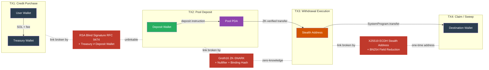

# TraceZero
Privacy-preserving transactions on Solana using ZK proofs, blind signatures, and Tor routing

## Architecture

### Protocol Flow

```mermaid
sequenceDiagram
    autonumber
    participant W as User Wallet
    participant D as dApp (Browser)
    participant Tor as Tor Network
    participant R as Relayer
    participant T as Treasury Wallet
    participant DW as Deposit Wallet
    participant S as Solana Program
    participant P as Pool PDA
    participant SA as Stealth Address
    participant Dst as Destination Wallet

    rect rgb(60, 60, 90)
        Note over W,T: Phase 1 — Credit Acquisition (visible on-chain, cryptographically unlinkable)
        D->>R: GET /info → RSA pubkey (n, e) + treasury Solana address
        D->>D: token_id = CSPRNG(256 bits)
        D->>D: r = random blinding factor
        D->>D: blinded_token = RSA_Blind(token_id, r, RSA_pubkey)
        W->>T: SystemProgram.transfer(amount + fee_bps) to Treasury Wallet
        Note over W,T: Treasury Wallet ≠ Deposit Wallet<br/>Separate keypairs, no on-chain link
        D->>D: Await TX finalized confirmation + RPC propagation delay
        D->>R: POST /sign {blinded_token, payment_tx_sig, payer_pubkey}
        R->>S: Fetch TX, verify pre/post balances (treasury received ≥ expected)
        R->>R: signed_blinded = RSA_BlindSign(blinded_token, RSA_privkey)
        R-->>D: signed_blinded_token
        D->>D: signature = RSA_Unblind(signed_blinded, r, RSA_pubkey)
        D->>D: Encrypt & store (token_id, signature) in localStorage
        Note over R: Relayer signed blinded_token without seeing token_id.<br/>Blinding factor r is never transmitted.<br/>Linking blinded ↔ unblinded is computationally infeasible.
    end

    rect rgb(40, 80, 60)
        Note over D,P: Phase 2 — Deposit via Tor (unlinkable to Phase 1, can be hours/days later)
        D->>D: nullifier = CSPRNG(256 bits)
        D->>D: secret = CSPRNG(256 bits)
        D->>D: commitment = Poseidon(DOMAIN_COMMIT, nullifier, secret, amount)
        D->>D: ECDH shared_secret = X25519(ephemeral_priv, relayer_ecdh_pub)
        D->>D: ciphertext = AES-256-GCM(payload, shared_secret)
        D->>Tor: Encrypted {token_id, signature, commitment, amount}
        Tor->>R: Forward (exit IP ≠ user IP)
        R->>R: Decrypt payload via ECDH + AES-256-GCM
        R->>R: RSA_Verify(token_id, signature, RSA_pubkey)
        R->>R: Assert H(token_id) ∉ UsedTokenStore (disk-persisted)
        R->>R: Persist H(token_id) to UsedTokenStore (atomic write + SHA-256 checksum)
        R->>R: Insert commitment into local Poseidon Merkle tree (depth=20)
        R->>R: merkle_root = recompute root
        DW->>S: deposit(bucket_id, commitment, token_hash, encrypted_note, merkle_root)
        Note over DW,S: Deposit Wallet is signer + fee payer.<br/>User wallet NEVER appears in this TX.
        S->>P: Update on-chain Merkle root + next_index
        S->>S: Init UsedToken PDA [seeds: "used_token", token_hash]
        S->>S: Init EncryptedNote PDA [seeds: "note", pool, index]
        R-->>Tor: {tx_signature, leaf_index}
        Tor-->>D: Forward response
        D->>D: Encrypt & store (nullifier, secret, leaf_index) in localStorage
    end

    rect rgb(80, 50, 50)
        Note over D,SA: Phase 3 — Withdrawal (Groth16 ZK proof, zero-knowledge of depositor)
        D->>D: stealth_seed = SHA-256(X25519_ECDH(eph_priv, view_pub) ‖ spend_pub)
        D->>D: stealth_keypair = Ed25519_FromSeed(stealth_seed)
        D->>D: Assert stealth_pub[0] & 0xE0 == 0 (BN254 field compatibility)
        D->>R: GET /pool/{bucket_id} → current merkle_root
        D->>R: GET /proof/{bucket_id}/{leaf_index} → siblings[], pathIndices[]
        D->>D: Verify Merkle proof locally (recompute root from commitment)
        D->>D: fee = amount × fee_bps ÷ 10000
        D->>D: Groth16 prove (WASM, ~10s in browser)
        Note over D: Public inputs: root, nullifierHash, recipient, amount, relayer, fee<br/>Public output: bindingHash = Poseidon(DOMAIN_BIND, nullifierHash, recipient, relayer, fee)<br/>Private inputs: nullifier, secret, pathElements[20], pathIndices[20]<br/>Proves: ∃ leaf ∈ MerkleTree s.t. leaf = Poseidon(DOMAIN_COMMIT, nullifier, secret, amount)
        D->>D: Verify proof locally before submission (snarkjs.groth16.verify)
        D->>Tor: {proof_a, proof_b, proof_c, public_inputs, nullifier_hash, recipient, binding_hash, delay_hours}
        Note over D,Tor: Different Tor circuit than Phase 2
        Tor->>R: Forward (different exit node)
        R->>S: request_withdrawal(proof, nullifier_hash, stealth_addr, binding_hash, delay)
        S->>S: CPI → ZK Verifier: Groth16 verify (proof_a negated, VK, public_inputs)
        S->>S: Assert nullifier_hash ∉ NullifierRegistry
        S->>S: Init PendingWithdrawal PDA [seeds: "pending", pool, tx_id]
        S->>S: Set execute_after = Clock::get() + random_delay
        Note over S: Timelock: 1-24 hours (user-chosen random delay)
        R->>R: Pre-fund recipient if balance < rent-exempt minimum (890,880 lamports)
        R->>R: Pre-fund treasury PDA if needed
        R->>S: execute_withdrawal(tx_id)
        S->>S: Assert Clock::get() ≥ execute_after
        S->>S: Init Nullifier PDA [seeds: "nullifier", hash] (marks spent)
        P->>SA: Credit (amount - fee) lamports via try_borrow_mut_lamports
        P->>T: Credit fee lamports to treasury
    end

    rect rgb(70, 70, 40)
        Note over SA,Dst: Phase 4 — Claim / Sweep (plain SOL transfer, no protocol involvement)
        D->>D: Load stealth secret key from localStorage
        D->>D: Reconstruct Ed25519 Keypair from stored secret key
        SA->>Dst: SystemProgram.transfer(balance - 5000 lamports TX fee)
        Note over SA,Dst: Stealth → Destination is visible on-chain,<br/>but Stealth → Deposit link is broken by ZK proof.<br/>Observer sees: "unknown address sent SOL to destination."
    end
```

### On-Chain Trace Analysis

### Privacy Primitives

| Primitive | Purpose | Where Used |
|-----------|---------|------------|
| RSA-2048 Blind Signatures (RFC 9474) | Cryptographic unlinkability between credit payment and token redemption | Phase 1 → Phase 2 boundary |
| Poseidon Hash (domain-separated) | ZK-friendly commitment: `H(DOMAIN, nullifier, secret, amount)` | Commitment, nullifier hash, binding hash, Merkle tree |
| Groth16 ZK-SNARK (Circom, depth-20 Merkle) | Prove Merkle membership without revealing leaf index or commitment | Withdrawal proof (~200k CU on-chain verification) |
| Nullifier Registry (on-chain PDA) | Prevent double-spend without revealing which deposit was consumed | Withdrawal execution |
| Binding Hash (Poseidon public output) | Cryptographically bind proof to specific recipient, relayer, and fee | Prevents proof front-running and parameter substitution |
| X25519 ECDH + Ed25519 Stealth Addresses | One-time unlinkable recipient addresses (BN254 field-compatible) | Withdrawal recipient generation |
| ECDH + AES-256-GCM Payload Encryption | End-to-end encryption of deposit requests (Tor exit node protection) | Deposit request payload |
| Tor Onion Routing (Docker SOCKS5 gateway) | Network-layer IP anonymity, different circuits per phase | Deposit + withdrawal request submission |
| Treasury / Deposit Wallet Separation | Break on-chain trace chain: pool → deposit wallet → ??? (dead end) | Relayer dual-wallet architecture |
| Randomized Timelock (1-24h) | Prevent timing correlation between request and execution | Withdrawal PendingWithdrawal PDA |
| Fixed Denomination Pools (7 buckets) | Prevent amount-based correlation across deposits/withdrawals | All pool operations |

## Technology Stack

- **Blockchain**: Solana (Anchor framework)
- **ZK Proofs**: Groth16 (Circom + snarkjs)
- **Blind Signatures**: RSA-2048 (RFC 9474)
- **Network Privacy**: Tor (Docker)
- **Frontend**: TanStack Start + React
- **Backend**: Rust (Axum)

## License

MIT
