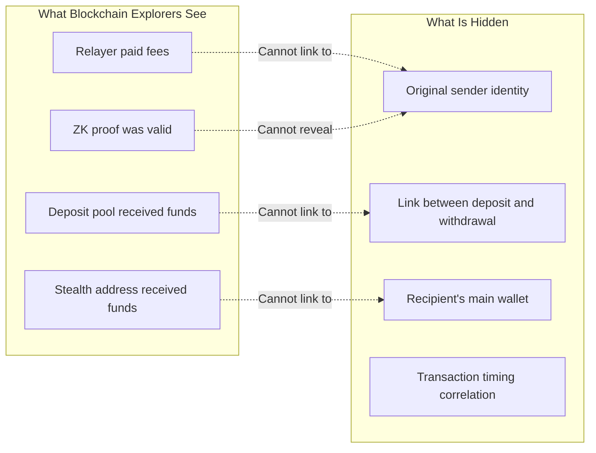
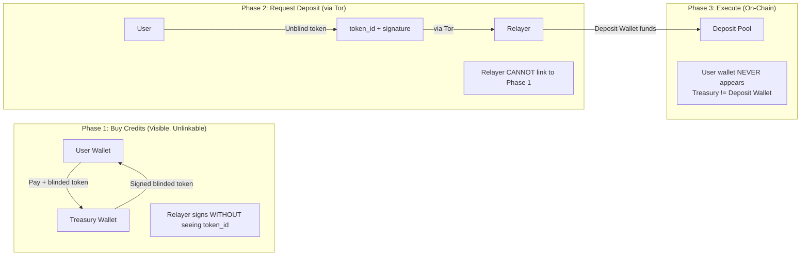
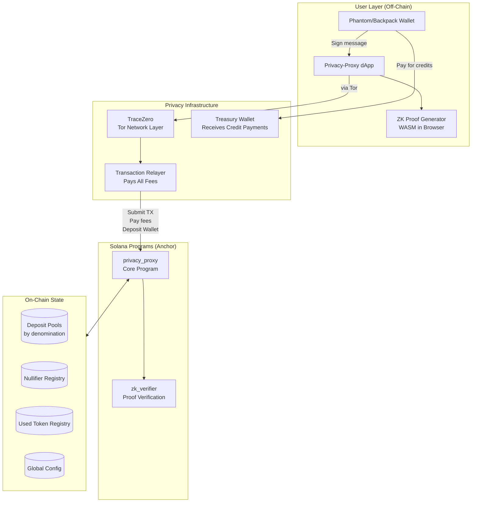
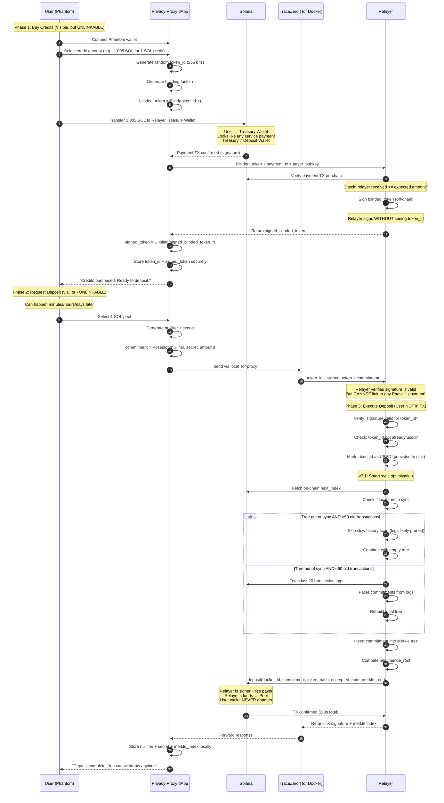
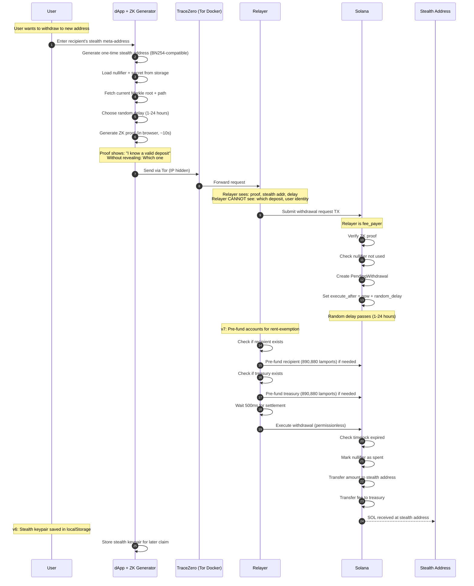
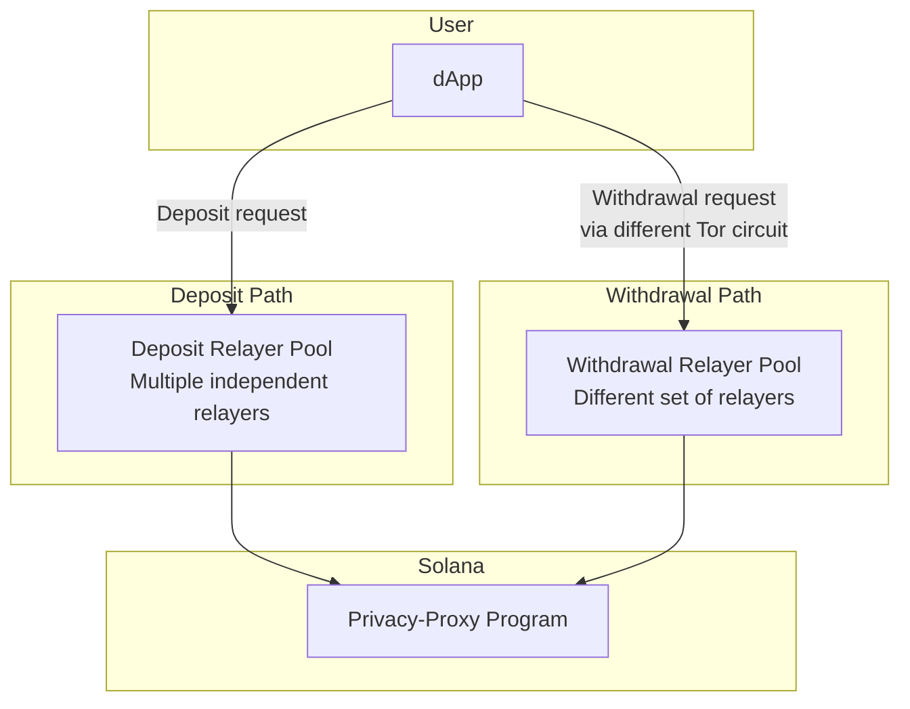
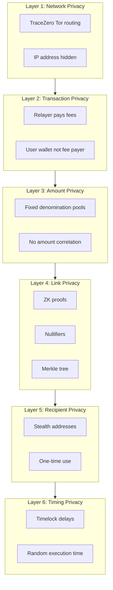
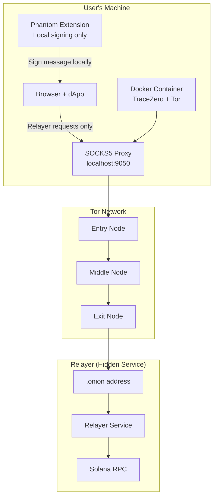
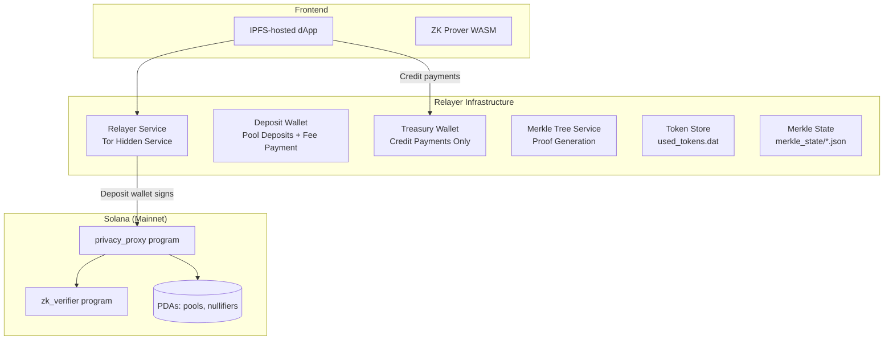

# Privacy-Proxy: Solana Protocol Architecture Design

## Document Overview

This document provides a comprehensive architecture design for Privacy-Proxy, a ZK-powered private transaction protocol on Solana. The core goal is **complete sender untraceability** - after a transaction completes, it should be impossible to trace back to the sender using Solscan or any blockchain explorer.

---

## Table of Contents

1. [Privacy Model & Threat Analysis](#1-privacy-model--threat-analysis)
2. [High-Level System Architecture](#2-high-level-system-architecture)
3. [Program Structure](#3-program-structure)
4. [Account Structure Mapping](#4-account-structure-mapping)
5. [User Interaction Flows](#5-user-interaction-flows)
6. [Wallet Integration Strategy](#6-wallet-integration-strategy)
7. [Security Architecture](#7-security-architecture)
8. [Network Layer Integration](#8-network-layer-integration)
9. [Deployment Architecture](#9-deployment-architecture)

---

## 1. Privacy Model & Threat Analysis

### 1.1 The Untraceability Problem

On Solana, every transaction exposes:
- **Fee payer** - Who paid for the transaction
- **Signers** - Who authorized the transaction
- **Account interactions** - Which accounts were touched
- **Timing** - When the transaction occurred
- **Amount** - How much was transferred

**Our goal**: Break ALL of these links between sender and recipient.

### 1.2 Critical Privacy Requirements

For TRUE untraceability, we must ensure:

1. **Deposit Unlinkability**: User's wallet should NOT directly appear as source
2. **Withdrawal Unlinkability**: No on-chain data links withdrawal to any deposit
3. **Relayer Blindness**: Relayer cannot correlate deposits with withdrawals
4. **Timing Decorrelation**: Deposits and withdrawals have no timing patterns
5. **Amount Uniformity**: All transactions in a pool look identical
6. **Recipient Unlinkability**: Stealth addresses reveal nothing

### 1.2 Privacy Guarantees



### 1.3 How We Achieve Untraceability

| Attack Vector | Mitigation |
|--------------|------------|
| Fee payer analysis | Relayer pays all fees, user never touches chain directly |
| Amount correlation | Fixed denomination pools (0.1, 1, 10, 100 SOL) |
| Timing correlation | Random delays (1-24 hours) + large anonymity sets |
| Deposit-withdrawal linking | ZK proofs with nullifiers |
| Recipient identification | Stealth addresses (one-time use) |
| IP address tracking | TraceZero network layer (Tor routing) |
| **Deposit source tracking** | **Relayer-funded deposits (user wallet never on-chain)** |
| **Relayer correlation** | **Split relayer architecture + encrypted requests** |
| **Credit payment correlation** | **Separate treasury wallet for credit payments (not the deposit wallet)** |
| **Merkle index analysis** | **Randomized insertion + batch processing** |

### 1.4 The TRUE Privacy Solution: Blinded Credits

**Problem**: Any transaction from user's wallet is visible on Solscan, even with Tor.

**Fundamental insight**: Network encryption (Tor) hides your IP, NOT your blockchain transactions. The only way to achieve TRUE untraceability is for the **user's wallet to NEVER be linkable to pool deposits**.

**Solution**: Blinded prepaid credits using blind signatures



**How it works:**
1. User generates random `token_id`, blinds it: `blinded = Blind(token_id, r)`
2. User pays relayer on-chain + sends blinded token for signing
3. Relayer signs blinded token (cannot see actual token_id)
4. User unblinds: `signed_token = Unblind(signed_blinded, r)`
5. Later, via Tor: User sends `token_id + signed_token + commitment`
6. Relayer verifies signature, deposits using ITS OWN funds
7. User's wallet NEVER appears in pool deposit TX

**What Solscan shows:**
- User → Relayer Treasury (payment) - Looks like any service payment
- Relayer Deposit Wallet → Pool (deposit) - NO link to any user, different wallet
- Pool → Stealth (withdrawal) - NO link to anything

**Why blinded credits + treasury separation achieve TRUE privacy:**
- Payment to treasury is visible but UNLINKABLE to deposit
- Blind signature cryptographically breaks the link
- Relayer cannot correlate Phase 1 payment with Phase 2 request
- User's wallet NEVER appears in any pool-related transaction
- Treasury wallet ≠ Deposit wallet, so tracing pool → deposit wallet → incoming payments reveals NOTHING about users

---

## 2. High-Level System Architecture

### 2.1 Complete System Overview



### 2.2 Key Insight: User Wallet NEVER Touches Pool

The critical privacy property: **User's wallet address should NEVER appear in any transaction related to the privacy pool.**

**Old (Broken) Approaches:**
```
❌ User Wallet → Pool                    (User directly visible)
❌ User Wallet → Shield → Pool           (User still visible in TX1)
```

**New (TRUE Privacy) Approach - Blinded Credits + Treasury Separation:**
```
✅ Phase 1: User pays treasury wallet (visible, but unlinkable)
✅ Phase 2: User redeems blinded token via Tor (relayer can't link)
✅ Phase 3: Relayer deposits using deposit wallet (user not in TX, different wallet than treasury)
```

**Why this achieves TRUE untraceability:**
1. Payment to treasury looks like any service payment
2. Blind signature cryptographically prevents linking payment to deposit
3. User's wallet NEVER appears in any pool-related transaction
4. Treasury wallet ≠ Deposit wallet — tracing pool deposits leads to a dead end

**For withdrawals** (already private):
- User generates ZK proof off-chain
- Relayer submits TX with proof
- Funds go to stealth address
- NO link to original depositor

---

## 3. Program Structure

### 3.1 Privacy-Proxy Core Program (Anchor)

```rust
// programs/privacy_proxy/src/lib.rs
use anchor_lang::prelude::*;

declare_id!("PPxy..."); // Program ID

#[program]
pub mod privacy_proxy {
    use super::*;
    
    /// Initialize global config (admin only, once)
    pub fn initialize(ctx: Context<Initialize>, config: GlobalConfigParams) -> Result<()>;
    
    /// Purchase credits from relayer - user pays, relayer signs blinded token
    /// This TX is visible but the blinded token is UNLINKABLE to future deposits
    pub fn purchase_credits(
        ctx: Context<PurchaseCredits>,
        amount: u64,
        blinded_token: [u8; 256],  // RSA blinded token
    ) -> Result<()>;
    
    /// Deposit to pool - ONLY callable by authorized relayer
    /// User's wallet NEVER appears in this transaction
    /// Relayer verified user's unblinded token off-chain
    pub fn deposit(
        ctx: Context<Deposit>,
        bucket_id: u8,
        commitment: [u8; 32],
        token_hash: [u8; 32],           // Hash of redeemed token (prevents double-spend)
        encrypted_note: Vec<u8>,        // Encrypted with user's viewing key
        merkle_root: [u8; 32],          // New Merkle root after insertion
    ) -> Result<()>;
    
    /// Request withdrawal with ZK proof
    pub fn request_withdrawal(
        ctx: Context<RequestWithdrawal>,
        bucket_id: u8,
        nullifier_hash: [u8; 32],
        recipient_stealth: Pubkey,
        proof: ZkProof,
        random_delay_hours: u8,  // User-chosen delay (1-24 hours)
    ) -> Result<()>;
    
    /// Execute withdrawal after timelock (permissionless)
    pub fn execute_withdrawal(ctx: Context<ExecuteWithdrawal>, tx_id: u64) -> Result<()>;
    
    /// Cancel pending withdrawal (requires ZK proof of ownership)
    pub fn cancel_withdrawal(
        ctx: Context<CancelWithdrawal>, 
        tx_id: u64,
        ownership_proof: ZkProof,  // Proves ownership without revealing identity
    ) -> Result<()>;
}

// Purchase credits - user pays relayer, gets blinded token signed
#[derive(Accounts)]
pub struct PurchaseCredits<'info> {
    #[account(mut)]
    pub user: Signer<'info>,  // User pays for credits
    
    #[account(mut)]
    pub relayer_treasury: SystemAccount<'info>,  // Relayer receives payment
    
    #[account(
        seeds = [b"config"],
        bump,
        has_one = relayer_treasury,
    )]
    pub config: Account<'info, GlobalConfig>,
    
    pub system_program: Program<'info, System>,
}

// Deposit to pool - user is NOT a signer, relayer uses its own funds
#[derive(Accounts)]
pub struct Deposit<'info> {
    #[account(mut)]
    pub relayer: Signer<'info>,  // Relayer signs and pays
    
    #[account(mut, seeds = [b"pool", &[bucket_id]], bump)]
    pub pool: Account<'info, DepositPool>,
    
    pub system_program: Program<'info, System>,
    // NOTE: No user account - user wallet NEVER touches this TX
}
```

### 3.2 ZK Verifier Program

```rust
// programs/zk_verifier/src/lib.rs
use anchor_lang::prelude::*;

declare_id!("ZKvf...");

#[program]
pub mod zk_verifier {
    use super::*;
    
    /// Verify withdrawal proof
    /// Proves: "I know a commitment in the Merkle tree, and here's its nullifier"
    /// Without revealing: Which commitment, or any link to depositor
    pub fn verify_withdrawal_proof(
        ctx: Context<VerifyWithdrawal>,
        proof: ZkProof,
        public_inputs: WithdrawalPublicInputs,
    ) -> Result<bool>;
}

#[derive(AnchorSerialize, AnchorDeserialize)]
pub struct WithdrawalPublicInputs {
    pub merkle_root: [u8; 32],      // Current root of deposit tree
    pub nullifier_hash: [u8; 32],   // Hash of nullifier (prevents double-spend)
    pub recipient: Pubkey,          // Stealth address to receive funds
    pub amount: u64,                // Must match bucket amount
}

#[derive(AnchorSerialize, AnchorDeserialize)]
pub struct ZkProof {
    pub a: [u8; 64],   // Groth16 proof element A
    pub b: [u8; 128],  // Groth16 proof element B  
    pub c: [u8; 64],   // Groth16 proof element C
}
```

### 3.3 ZK Circuit (What the Proof Proves)

```
// Withdrawal Circuit (Circom)
// Public inputs: merkle_root, nullifier_hash, recipient, amount
// Private inputs: nullifier, secret, merkle_path, path_indices

template Withdrawal() {
    // Private inputs (known only to prover)
    signal private input nullifier;
    signal private input secret;
    signal private input merkle_path[TREE_DEPTH];
    signal private input path_indices[TREE_DEPTH];
    
    // Public inputs (visible on-chain)
    signal input merkle_root;
    signal input nullifier_hash;
    signal input recipient;
    signal input amount;
    
    // 1. Compute commitment = Poseidon(nullifier, secret, amount)
    component commitment_hasher = Poseidon(3);
    commitment_hasher.inputs[0] <== nullifier;
    commitment_hasher.inputs[1] <== secret;
    commitment_hasher.inputs[2] <== amount;
    
    // 2. Verify commitment is in Merkle tree
    component merkle_verifier = MerkleTreeVerifier(TREE_DEPTH);
    merkle_verifier.leaf <== commitment_hasher.out;
    merkle_verifier.root <== merkle_root;
    for (var i = 0; i < TREE_DEPTH; i++) {
        merkle_verifier.path[i] <== merkle_path[i];
        merkle_verifier.indices[i] <== path_indices[i];
    }
    
    // 3. Verify nullifier_hash = Poseidon(nullifier)
    component nullifier_hasher = Poseidon(1);
    nullifier_hasher.inputs[0] <== nullifier;
    nullifier_hash === nullifier_hasher.out;
    
    // 4. Recipient is bound to proof (prevents front-running)
    signal recipient_check;
    recipient_check <== recipient;
}
```

---

## 4. Account Structure Mapping

### 4.1 Account Hierarchy

```mermaid
flowchart TB
    subgraph Global["Global (1 per deployment)"]
        CONFIG[GlobalConfig PDA<br/>seeds: b"config"]
    end
    
    subgraph Pools["Deposit Pools (7 buckets)"]
        P0[Pool 0.1 SOL<br/>seeds: b"pool", 0]
        P1[Pool 1 SOL<br/>seeds: b"pool", 1]
        P2[Pool 10 SOL<br/>seeds: b"pool", 2]
        P3[Pool 100 SOL<br/>seeds: b"pool", 3]
    end
    
    subgraph Nullifiers["Nullifier Registry"]
        N1[Nullifier PDA<br/>seeds: b"nullifier", hash]
    end
    
    subgraph UsedTokens["Used Token Registry"]
        UT1[UsedToken PDA<br/>seeds: b"used_token", token_hash]
    end
    
    subgraph Pending["Pending Withdrawals"]
        PW[PendingWithdrawal PDA<br/>seeds: b"pending", pool, tx_id]
    end
    
    CONFIG --> Pools
    Pools --> Pending
    Pending --> Nullifiers
    Pools --> UsedTokens
```

### 4.2 Account Schemas

```rust
// Global configuration
#[account]
pub struct GlobalConfig {
    pub admin: Pubkey,
    pub relayer_treasury: Pubkey,      // Where credit payments go
    pub authorized_relayer: Pubkey,    // Only this relayer can execute deposits
    pub relayer_signing_key: [u8; 256], // RSA public key for blind signatures
    pub fee_bps: u16,                  // Fee in basis points (e.g., 50 = 0.5%)
    pub min_delay_hours: u8,           // Minimum withdrawal delay
    pub max_delay_hours: u8,           // Maximum withdrawal delay
    pub paused: bool,
    pub bump: u8,
}

// Deposit pool for a specific denomination
#[account]
pub struct DepositPool {
    pub bucket_id: u8,
    pub amount_lamports: u64,      // Fixed amount for this pool
    pub merkle_root: [u8; 32],     // Current Merkle root
    pub next_index: u64,           // Next leaf index (randomized insertion)
    pub total_deposits: u64,
    pub anonymity_set_size: u64,   // Number of unspent deposits
    pub bump: u8,
}

// Nullifier to prevent double-spend
#[account]
pub struct NullifierRecord {
    pub nullifier_hash: [u8; 32],
    pub spent_at: i64,
    pub bump: u8,
}

// Used token record - prevents double-redemption of blinded credits
#[account]
pub struct UsedToken {
    pub token_hash: [u8; 32],      // Hash of redeemed token_id
    pub redeemed_at: i64,
    pub bump: u8,
}

// Pending withdrawal (timelock)
#[account]
pub struct PendingWithdrawal {
    pub tx_id: u64,
    pub pool: Pubkey,
    pub recipient: Pubkey,         // Stealth address
    pub amount: u64,
    pub fee: u64,
    pub execute_after: i64,        // Timestamp when executable (randomized)
    pub nullifier_hash: [u8; 32],
    pub status: WithdrawalStatus,
    pub bump: u8,
}

// Encrypted note stored on-chain (only user can decrypt)
#[account]
pub struct EncryptedNote {
    pub pool: Pubkey,
    pub ciphertext: [u8; 128],     // Encrypted (nullifier, secret, merkle_index)
    pub ephemeral_pubkey: [u8; 32], // For ECDH decryption
    pub created_at: i64,
    pub bump: u8,
}

#[derive(AnchorSerialize, AnchorDeserialize, Clone, PartialEq)]
pub enum WithdrawalStatus {
    Pending,
    Executed,
    Cancelled,
}
```

---

## 5. User Interaction Flows

### 5.1 Blinded Credits Deposit Flow (TRUE Untraceability)

**Critical insight**: Any on-chain transaction from user's wallet is visible. The ONLY way to break the link is cryptographic unlinkability via blind signatures.

**Solution**: User pays for credits, then redeems via Tor. Relayer CANNOT link payment to deposit.



**What Solscan shows:**
- **Credit Purchase TX**: User → Relayer Treasury (looks like any service payment)
- **Deposit TX**: Relayer Deposit Wallet → Pool (user wallet NOT visible, different wallet)
- **NO LINK** between the two transactions (blind signature + wallet separation breaks it)

**Why blinded credits achieve TRUE privacy:**

```
Phase 1 - Relayer sees:
  - User A paid 10.05 SOL
  - User A sent blinded_token = 0x7F3A9B2C... (random bytes)
  - Relayer signed it, returned 0xE4D1F8A2...

Phase 2 - Relayer sees (via Tor):
  - Someone sent token_id = 0x1234ABCD...
  - With valid signature = 0x9876FEDC...
  - Wants deposit with commitment = 0xDEADBEEF...

Can relayer link Phase 1 to Phase 2?
  - Is 0x1234ABCD related to 0x7F3A9B2C? NO! (blinding)
  - Is 0x9876FEDC related to 0xE4D1F8A2? NO! (unblinding transformed it)
  - WITHOUT knowing blinding factor 'r', linking is MATHEMATICALLY IMPOSSIBLE
```

### 5.2 Withdrawal Flow (Completely Anonymous)



**What Solscan shows:**
- Fee payer: Relayer
- Transfer: Pool → Stealth address
- ZK proof: Valid (reveals nothing)
- Nullifier: Random hash (can't reverse)
- Timing: Random delay (no pattern)

**Privacy achieved**: 
- No link between deposit and withdrawal
- Recipient is a fresh stealth address
- User's wallet NEVER appears in withdrawal TX
- Random delays prevent timing analysis

### 5.4 Claim/Sweep Flow (Fund Recovery from Stealth Address)

After `execute_withdrawal`, funds sit on the stealth address. The user sweeps them to any destination wallet.

```
User → Claim Page → Select stealth address → Enter destination → Sign with stealth key → SOL transfer
```

**Key properties**:
- Plain `SystemProgram.transfer` — no ZK proof, no relayer, no Tor
- Signed with the stealth keypair (saved in localStorage during withdrawal)
- The stealth → destination link is visible on-chain, but stealth → deposit is broken by ZK
- An observer sees "random address sent SOL to destination" — no link to the privacy pool

**What gets stored per withdrawal** (in `localStorage`):
```json
{
  "stealthAddress": "base58...",
  "stealthSecretKey": "base64 (64-byte Ed25519 secret key)",
  "ephemeralPubkey": "base64...",
  "amount": 1000000000,
  "createdAt": 1708000000000,
  "swept": false
}
```

**Backup**: Users can export/import stealth keys as JSON from the Claim page. Critical before clearing localStorage.

### 5.3 Stealth Address Generation (Off-Chain)

Stealth addresses are generated entirely off-chain. NO ephemeral keys are published on-chain.

```mermaid
flowchart LR
    subgraph Recipient["Recipient Setup (one-time, off-chain)"]
        R1[Generate spend key pair<br/>spend_priv, spend_pub]
        R2[Generate view key pair<br/>view_priv, view_pub]
        R3[Share meta-address privately<br/>spend_pub || view_pub]
    end
    
    subgraph Sender["Sender (per withdrawal, off-chain)"]
        S1[Receive meta-address from recipient]
        S2[Generate ephemeral key pair<br/>eph_priv, eph_pub]
        S3[shared_secret = ECDH eph_priv, view_pub]
        S4[stealth_pub = spend_pub + H shared_secret times G]
        S5[Include eph_pub in encrypted note to recipient]
    end
    
    subgraph OnChain["What Goes On-Chain"]
        OC1[Only stealth_pub as recipient]
        OC2[NO ephemeral key published]
        OC3[Recipient scans via off-chain channel]
    end
    
    R1 --> R2 --> R3
    R3 -.->|Private channel| S1
    S1 --> S2 --> S3 --> S4 --> S5
    S4 --> OC1
```

**Why NO ephemeral key on-chain:**
- Publishing eph_pub creates a scannable pattern
- Instead, sender sends eph_pub directly to recipient (encrypted)
- Recipient uses private notification channel (e.g., encrypted message)

**Recipient detection:**
- Recipient receives encrypted notification with eph_pub
- Computes expected stealth address
- Scans blockchain for matching deposits
- Derives spend key to claim funds

---

## 6. Relayer Architecture (Preventing Correlation)

### 6.1 The Relayer Correlation Problem

A single relayer that handles both deposits and withdrawals can correlate:
- Timing of deposit request → withdrawal request
- IP addresses (even through Tor, timing attacks possible)
- Request patterns

### 6.2 Solution: Split Relayer Architecture



**Key properties:**
1. Deposit and withdrawal use DIFFERENT relayers
2. User connects via DIFFERENT Tor circuits
3. Relayers don't share logs
4. Even if one relayer is compromised, it only sees half the picture

### 6.3 Encrypted Requests

All requests to relayers are encrypted:

```rust
pub struct EncryptedRequest {
    pub ephemeral_pubkey: [u8; 32],  // For ECDH
    pub ciphertext: Vec<u8>,         // Encrypted payload
    pub nonce: [u8; 24],             // ChaCha20 nonce
}

// Relayer decrypts, processes, then DELETES
// No logs of request content
```

### 6.4 Treasury Wallet Separation (Anti-Correlation)

**Problem**: If the relayer uses the same wallet to receive credit payments AND deposit to the pool, an attacker can trace: `withdrawal → pool → relayer wallet → incoming payments → user wallets`. With a small anonymity set, this reveals the sender.

**Solution**: The relayer uses two separate wallets:

| Wallet | Purpose | On-Chain Activity |
|--------|---------|-------------------|
| Treasury Wallet (`TREASURY_KEYPAIR_PATH`) | Receives credit payments from users | User → Treasury (visible, unlinkable) |
| Deposit Wallet (`KEYPAIR_PATH`) | Signs pool deposit transactions, pays fees | Deposit Wallet → Pool (no user link) |

```
Trace attempt:
  withdrawal → pool → deposit wallet → ???
  
  Deposit wallet has NO incoming payments from users.
  Users paid the treasury wallet instead.
  Chain is broken.
```

**Configuration:**
```bash
# Generate a separate treasury wallet
solana-keygen new -o treasury.json

# Set environment variables
export KEYPAIR_PATH=~/.config/solana/id.json      # Deposit wallet (pool operations)
export TREASURY_KEYPAIR_PATH=./treasury.json       # Treasury wallet (credit payments)
```

**Backward compatibility**: If `TREASURY_KEYPAIR_PATH` is not set, the relayer falls back to using the main keypair for both (with a warning). This is NOT recommended for production.

### 6.5 Relayer State Management

The relayer maintains two critical pieces of state:

**1. Used Token Store (Prevents Double-Spend)**
```rust
// Persistent storage at: used_tokens.dat
// Format: Concatenated 32-byte token hashes
// Checksum: SHA256 of all tokens (stored in used_tokens.checksum)

struct TokenStore {
    cache: HashSet<[u8; 32]>,  // In-memory for fast lookups
    path: PathBuf,              // Disk persistence
    checksum: [u8; 32],         // Integrity verification
}
```

**Key properties:**
- Persisted to disk (survives relayer restarts)
- Checksummed for corruption detection
- Atomic writes (temp file + rename)
- Fast in-memory lookups

**2. Merkle Tree State (Tracks Deposits)**
```
// Persistent storage at: merkle_state/bucket_{id}.json
// Contains: All commitments + current root

- Synced with on-chain state on startup
- Smart sync: Skips history if >50 old transactions
- Rebuilds from last 20 transactions if ≤50 old
```

**Why persistence matters:**
- Token store: Prevents accepting same credit twice after restart
- Merkle tree: Enables proof generation for withdrawals
- Both critical for security and functionality

---

## 7. Wallet Integration Strategy

### 7.1 Decision: Use Existing Wallets (Phantom/Backpack)

**Why NOT build a custom wallet:**
- Users trust established wallets
- Security audits already done
- Seed phrase management solved
- Browser extension ecosystem

**How we integrate:**
- User connects Phantom/Backpack locally (no Tor for wallet connection)
- For credit purchase: User signs and submits TX directly (visible, but unlinkable via blind signature)
- For pool deposits: User sends token via Tor, relayer deposits (user wallet NOT in TX)
- For withdrawals: No signature needed (ZK proof is authorization)

### 7.2 Two-Phase Deposit: Blinded Credits

**Phase 1: Purchase Credits (Visible, but UNLINKABLE)**

```typescript
import BlindSignature from 'blind-signatures';

// Generate blinded token
const tokenId = crypto.randomBytes(32);
const { blinded, r } = BlindSignature.blind({
  message: tokenId,
  N: relayerPublicKey.n,
  E: relayerPublicKey.e,
});

// Purchase credits on-chain - this TX IS visible
// But the blinded token is UNLINKABLE to future deposits
const purchaseTx = await program.methods
  .purchaseCredits(
    new BN(10.05 * LAMPORTS_PER_SOL),
    Array.from(blinded)
  )
  .accounts({
    user: wallet.publicKey,
    relayerTreasury: RELAYER_TREASURY,
    config: configPda,
    systemProgram: SystemProgram.programId,
  })
  .transaction();

const signature = await wallet.sendTransaction(purchaseTx, connection);
// Solscan shows: User → Relayer Treasury (looks like any payment)

// Relayer signs the blinded token (off-chain API call)
const signedBlinded = await relayerApi.signBlindedToken(blinded);

// Unblind to get valid signature on original token
const signedToken = BlindSignature.unblind({
  signed: signedBlinded,
  N: relayerPublicKey.n,
  r: r,
});

// Store securely - this is your "credit"
localStorage.setEncrypted('credit', { tokenId, signedToken, amount: 10.05 });
```

**Phase 2: Request Deposit (via Tor - UNLINKABLE)**

```typescript
// Load stored credit
const { tokenId, signedToken } = localStorage.getDecrypted('credit');

// Generate deposit commitment
const nullifier = crypto.randomBytes(32);
const secret = crypto.randomBytes(32);
const commitment = poseidon([nullifier, secret, amount]);

// Send to relayer via Tor - relayer CANNOT link to Phase 1
const depositRequest = {
  tokenId: tokenId.toString('hex'),
  signedToken: signedToken.toString('hex'),
  commitment: commitment.toString('hex'),
  pool: bucketId,
  encryptedNote: encryptedNote,
};

// Via Tor proxy - IP hidden, token unlinkable
const response = await relayerClient.requestDeposit(depositRequest);

// Store for withdrawal
localStorage.setEncrypted('deposit', { nullifier, secret, merkleIndex: response.index });
```

**Why this achieves TRUE privacy:**
- Phase 1 payment is visible but blinded token is random bytes
- Phase 2 redemption via Tor with unblinded token
- Relayer CANNOT mathematically link Phase 1 to Phase 2
- User's wallet NEVER appears in pool deposit TX

### 7.3 Withdrawal: No User Signature Needed

For withdrawals, the ZK proof IS the authorization:

```typescript
// No wallet signature needed - ZK proof proves ownership
const withdrawalRequest = {
  proof: zkProof,           // Generated in browser
  nullifierHash: nullifier,
  recipient: stealthAddress,
  delay: randomDelay,
};

// Send to relayer via Tor - relayer submits TX
await relayerClient.requestWithdrawal(withdrawalRequest);
```

### 7.4 Privacy Analysis of Wallet Interaction

| Action | User Wallet Visible On-Chain? | Linkable to Pool Deposit? |
|--------|------------------------------|---------------------------|
| Purchase Credits | YES (user pays treasury wallet) | **NO** - Blind signature + treasury ≠ deposit wallet |
| Blinded Token Signing | NO (off-chain) | NO - Relayer can't see token_id |
| Deposit Request | NO (via Tor) | **NO** - Token is unlinkable |
| Pool Deposit TX | NO (deposit wallet signs) | NO - User not in TX |
| Request Withdrawal | NO (ZK proof via Tor) | NO - Proof reveals nothing |
| Execute Withdrawal | NO (Permissionless) | NO - Goes to stealth addr |

**Key insight**: The blind signature cryptographically breaks the link between the visible payment (Phase 1) and the deposit request (Phase 2). The treasury wallet separation adds a second layer: even if an attacker traces pool deposits back to the deposit wallet, they find NO incoming user payments there — those went to the treasury wallet instead.

---

## 8. Security Architecture

### 8.1 Defense in Depth



### 8.2 What an Attacker Sees

| Information | Visible? | Can Link to Depositor? |
|-------------|----------|------------------------|
| Credit Purchase TX (User → Treasury) | Yes | **NO** - Blind signature unlinkable, treasury ≠ deposit wallet |
| Blinded token in purchase | Yes | NO - Random bytes, meaningless |
| Deposit TX (Deposit Wallet → Pool) | Yes | NO - User wallet not in TX, different wallet than treasury |
| Deposit commitment | Yes | NO - Random hash |
| Withdrawal TX | Yes | NO - Different time, stealth addr |
| ZK proof | Yes | NO - Reveals nothing |
| Nullifier | Yes | NO - Can't reverse hash |
| Fee payer | Yes | Always relayer deposit wallet |
| Timing | Yes | Random delays (1-24h) |

**Key insight**: The credit purchase is visible, but the blinded token makes it MATHEMATICALLY IMPOSSIBLE to link to any specific deposit. The attacker sees "User A paid relayer" but cannot determine which pool deposit (if any) corresponds to that payment.

### 8.3 Anonymity Set Size

The privacy guarantee depends on the **anonymity set** - how many deposits look identical:

```
Privacy = log2(anonymity_set_size)

Example:
- 100 deposits in 10 SOL pool
- Attacker knows withdrawal came from one of 100
- Privacy = log2(100) ≈ 6.6 bits

Target: 1000+ deposits per pool = 10 bits of privacy
```

---

## 9. Network Layer Integration

### 9.1 TraceZero Integration (Tor via Docker)

TraceZero runs Tor as a local Docker service, providing a SOCKS5 proxy for the dApp.

**Important clarification:**
- Phantom wallet connects **locally** (no Tor needed for wallet)
- User signs messages **locally** with Phantom (off-chain, no network)
- Only **relayer communication** goes through Tor (deposit/withdrawal requests)



### 9.2 What Goes Through Tor (and What Doesn't)

| Action | Through Tor? | Why |
|--------|--------------|-----|
| Connect Phantom wallet | ❌ NO | Local browser extension |
| Sign message with Phantom | ❌ NO | Local cryptographic operation |
| Purchase credits (on-chain TX) | ❌ NO | User submits TX directly (visible but unlinkable) |
| Request deposit from relayer | ✅ YES | Hides IP from relayer |
| Request withdrawal from relayer | ✅ YES | Hides IP from relayer |
| Fetch Merkle proof | ✅ YES | Hides which deposit user is interested in |

### 9.3 TraceZero Docker Setup

```yaml
# docker-compose.yml
version: '3.8'
services:
  tracezero:
    image: tracezero/tor-proxy:latest
    container_name: tracezero
    ports:
      - "9050:9050"   # SOCKS5 proxy
      - "9051:9051"   # Control port
    volumes:
      - tor-data:/var/lib/tor
    environment:
      - TOR_SOCKS_PORT=9050
      - TOR_CONTROL_PORT=9051
    restart: unless-stopped

volumes:
  tor-data:
```

### 9.4 Backend Proxy Gateway (HTTP → SOCKS5 Bridge)

**Problem**: Browser `fetch()` API cannot use SOCKS5 proxies directly. The `agent` option only works in Node.js.

**Solution**: Run a local HTTP-to-SOCKS5 gateway alongside the Tor Docker container. The browser makes HTTP requests to localhost, which forwards them through Tor.

```yaml
# docker-compose.yml (updated)
version: '3.8'
services:
  tracezero:
    image: tracezero/tor-proxy:latest
    container_name: tracezero
    ports:
      - "9050:9050"   # SOCKS5 proxy (internal)
    volumes:
      - tor-data:/var/lib/tor
    restart: unless-stopped

  tor-gateway:
    image: tracezero/tor-gateway:latest
    container_name: tor-gateway
    ports:
      - "3080:3080"   # HTTP gateway for browser
    environment:
      - TOR_SOCKS_HOST=tracezero
      - TOR_SOCKS_PORT=9050
      - GATEWAY_PORT=3080
    depends_on:
      - tracezero
    restart: unless-stopped

volumes:
  tor-data:
```

**Gateway Implementation** (Node.js service):

```typescript
// tor-gateway/src/server.ts
import express from 'express';
import { SocksProxyAgent } from 'socks-proxy-agent';
import fetch from 'node-fetch';

const app = express();
app.use(express.json());

const TOR_PROXY = `socks5h://${process.env.TOR_SOCKS_HOST}:${process.env.TOR_SOCKS_PORT}`;
const proxyAgent = new SocksProxyAgent(TOR_PROXY);

// Proxy endpoint - forwards requests through Tor
app.post('/proxy', async (req, res) => {
  const { url, method, body } = req.body;
  
  try {
    const response = await fetch(url, {
      method: method || 'POST',
      headers: { 'Content-Type': 'application/json' },
      body: JSON.stringify(body),
      agent: proxyAgent,
    });
    
    const data = await response.json();
    res.json(data);
  } catch (error) {
    res.status(500).json({ error: 'Tor request failed' });
  }
});

app.listen(3080, () => console.log('Tor Gateway on :3080'));
```

**Browser Client** (works in any browser):

```typescript
// app/src/lib/api/relayer.ts
const TOR_GATEWAY = 'http://localhost:3080';
const RELAYER_ONION = 'http://privacyproxyxxxxxxx.onion';

class RelayerClient {
  // All requests go through local gateway → Tor → Relayer
  private async torFetch(endpoint: string, body: any): Promise<any> {
    const response = await fetch(`${TOR_GATEWAY}/proxy`, {
      method: 'POST',
      headers: { 'Content-Type': 'application/json' },
      body: JSON.stringify({
        url: `${RELAYER_ONION}${endpoint}`,
        method: 'POST',
        body: body,
      }),
    });
    return response.json();
  }
  
  async requestDeposit(auth: DepositAuthorization): Promise<DepositResponse> {
    return this.torFetch('/deposit', auth);
  }
  
  async requestWithdrawal(req: WithdrawalRequest): Promise<WithdrawalResponse> {
    return this.torFetch('/withdraw', req);
  }
  
  async getMerkleProof(commitment: string): Promise<MerkleProof> {
    return this.torFetch('/merkle-proof', { commitment });
  }
}

export const relayerClient = new RelayerClient();
```

**Traffic Flow:**
```
Browser (any) → HTTP localhost:3080 → Tor Gateway → SOCKS5 :9050 → Tor Network → .onion Relayer
```

**Why this works:**
- Browser makes standard HTTP requests (no SOCKS5 needed)
- Gateway runs locally, handles SOCKS5 complexity
- All bundled in Docker, single `docker-compose up -d`
- Works in Chrome, Firefox, Safari, any browser

### 9.5 User Setup Flow

1. User installs Docker Desktop (if not already installed)
2. User runs: `docker-compose up -d` (starts TraceZero Tor proxy)
3. User opens dApp in browser
4. dApp detects Tor proxy on localhost:9050
5. All relayer communication automatically routed through Tor

**Alternative: Electron App**
For users who don't want Docker, we can provide an Electron app that bundles Tor:
- Single download, no Docker required
- Tor runs embedded in the app
- Same privacy guarantees

---

## 10. Deployment Architecture

### 10.1 Component Deployment



### 10.2 Relayer Economics

The relayer needs to be economically sustainable:

```
Fee structure:
- User pays: amount + fee to treasury wallet (e.g., 0.5%)
- Treasury receives: amount + fee
- Deposit wallet pays: Solana TX fees (~0.000005 SOL)
- Relayer operator periodically transfers funds from treasury → deposit wallet (off-chain)

Example (10 SOL withdrawal):
- User deposits: 10.05 SOL → Treasury Wallet
- Pool receives: 10 SOL (from Deposit Wallet)
- Fee to treasury: 0.05 SOL
- Deposit wallet TX cost: ~0.00001 SOL
- Relayer profit: ~0.05 SOL
```

---

## 11. Proving Untraceability (Test Strategy)

### 11.1 What the Test Proves

The test will:
1. Perform a deposit from Wallet A
2. Perform a withdrawal to Stealth Address B
3. Log the entire transaction chain
4. Demonstrate that NO on-chain data links A to B

### 11.2 Test Scenario

```
Given:
  - Alice has wallet A with 100 SOL
  - Alice wants to send 10 SOL to Bob privately
  - Bob has stealth meta-address (spend_pub, view_pub)
  - Relayer has two wallets: Treasury (receives payments) and Deposit (pool operations)
  
When:
  1. Alice purchases credits: pays 10.05 SOL with blinded token (TX1: Alice → Treasury Wallet)
  2. Relayer signs blinded token, Alice unblinds to get valid credit
  3. Alice sends token_id + signed_token + commitment to relayer via Tor
  4. Relayer deposits 10 SOL to pool using deposit wallet (TX2: Deposit Wallet → Pool)
  5. Alice generates ZK proof for withdrawal
  6. Alice withdraws to stealth address for Bob (TX3: Pool → Stealth)
  
Then:
  - TX1 shows: Alice → Treasury Wallet (looks like any service payment)
  - TX2 shows: Deposit Wallet → Pool (Alice's wallet NOT visible, different wallet)
  - TX3 shows: Pool → Stealth (no link to Alice or any previous TX)
  - TX1 and TX2 are MATHEMATICALLY UNLINKABLE (blind signature + wallet separation)
  - Tracing pool → deposit wallet reveals NO user payments (they went to treasury)
  - NO on-chain data links Alice to the privacy pool deposit
  - NO on-chain data links Alice to Bob
  - Nullifier cannot be reversed
  - Stealth address cannot be linked to Bob's main wallet
```

### 11.3 Verification Checklist

| Check | Expected Result |
|-------|-----------------|
| TX1 (Credit purchase) | Alice visible, but pays treasury wallet (not deposit wallet) |
| TX2 (Pool deposit) | Deposit wallet visible, Alice NOT visible |
| TX3 (Withdrawal) | Deposit wallet visible, stealth addr recipient |
| Link TX1 → TX2 | **IMPOSSIBLE** - Blind signature + different wallets |
| Trace Pool → Deposit Wallet → Users | **NONE** - Users paid treasury, not deposit wallet |
| Direct link Alice → Pool | **NONE** - Alice never touches pool |
| Direct link Pool → Bob | NONE (stealth address) |
| Timing correlation | Broken by random delays |
| Nullifier reversibility | Impossible (hash preimage) |
| Stealth address linkability | Only Bob can detect |

---

## Appendix A: Complete Privacy Audit Checklist

| Attack Vector | Mitigated? | How |
|--------------|------------|-----|
| Fee payer analysis | ✅ | Relayer pays all pool TX fees |
| Direct deposit linking | ✅ | User wallet NEVER in pool TX |
| Credit purchase correlation | ✅ | **Blind signature makes linking impossible** |
| Credit payment tracing | ✅ | **Treasury wallet ≠ Deposit wallet — trace chain broken** |
| Amount correlation | ✅ | Fixed denomination pools |
| Timing correlation | ✅ | Random delays 1-24 hours |
| Merkle index analysis | ✅ | Randomized insertion |
| Relayer correlation | ✅ | Split relayer architecture |
| IP tracking | ✅ | Tor via Docker (TraceZero) |
| Recipient identification | ✅ | Stealth addresses |
| Ephemeral key scanning | ✅ | No eph_pub on-chain |
| ZK proof analysis | ✅ | Reveals nothing |
| Nullifier reversal | ✅ | Hash preimage impossible |
| Token double-spend | ✅ | UsedToken registry on-chain |

---

## Appendix B: Account Sizes

```
GlobalConfig:      8 + 32 + 32 + 32 + 256 + 2 + 1 + 1 + 1 + 1 = 366 bytes (includes RSA pubkey)
DepositPool:       8 + 1 + 8 + 32 + 8 + 8 + 8 + 1 = 74 bytes
NullifierRecord:   8 + 32 + 8 + 1 = 49 bytes
UsedToken:         8 + 32 + 8 + 1 = 49 bytes
PendingWithdrawal: 8 + 8 + 32 + 32 + 8 + 8 + 8 + 32 + 1 + 1 = 138 bytes
EncryptedNote:     8 + 32 + 128 + 32 + 8 + 1 = 209 bytes
```

## Appendix C: Bucket Denominations

| Bucket ID | Amount (SOL) | Amount (Lamports) |
|-----------|--------------|-------------------|
| 0 | 0.1 | 100,000,000 |
| 1 | 0.5 | 500,000,000 |
| 2 | 1 | 1,000,000,000 |
| 3 | 5 | 5,000,000,000 |
| 4 | 10 | 10,000,000,000 |
| 5 | 50 | 50,000,000,000 |
| 6 | 100 | 100,000,000,000 |

---

## Appendix D: Performance Characteristics

### Deposit Performance (v7.1)

| Scenario | Time | Notes |
|----------|------|-------|
| Fresh relayer start (>50 old txs) | 2-3s | Skips slow history scan |
| Fresh relayer start (≤50 old txs) | 3-5s | Scans last 20 transactions |
| Relayer with synced state | 1-2s | No sync needed |
| Frontend timeout limit | 120s | Increased from 30s (v6.2) |

**Optimization Strategy**:
- Skip transaction history scan if >50 transactions (logs likely pruned)
- Only scan last 20 transactions if ≤50 total
- Continue with empty tree if no commitments found
- New deposits always work immediately

### Withdrawal Performance

| Operation | Time | Notes |
|-----------|------|-------|
| ZK proof generation (browser) | 8-12s | WASM in browser |
| Withdrawal request submission | 1-2s | Via Tor |
| Timelock delay | 1-24h | User-chosen, random |
| Withdrawal execution | 2-3s | Includes rent pre-funding |
| Rent pre-funding (if needed) | +0.5s | One-time per account |

**Rent-Exemption Handling (v7)**:
- Relayer checks recipient and treasury accounts before execution
- Pre-funds with 890,880 lamports (rent-exempt minimum) if needed
- Tops up existing accounts if balance < rent-exempt minimum
- 500ms delay after pre-funding for settlement
- No impact on user's received amount

### Credit Purchase Performance

| Operation | Time | Notes |
|-----------|------|-------|
| Blind token generation | <100ms | Client-side RSA |
| SOL payment transaction | 1-2s | On-chain, visible |
| Payment verification (relayer) | 2-20s | RPC fetch with retries |
| Blind signature | <100ms | Server-side RSA |
| Unblind signature | <100ms | Client-side |

**Payment Verification (v6.2)**:
- Relayer fetches transaction from RPC with 10 retries
- 2-second delay between retries
- Total wait time: up to 20 seconds for devnet propagation
- Only signs after confirming payment received

### Network Performance

| Operation | Latency | Notes |
|-----------|---------|-------|
| Tor circuit establishment | 30-60s | One-time on startup |
| Request via Tor | +1-3s | Compared to direct |
| ECDH key exchange | <100ms | One-time per session |
| AES-256-GCM encryption | <10ms | Per request |

---

*Last updated: v7.2 (February 2026) — Added treasury wallet separation for anti-correlation*
